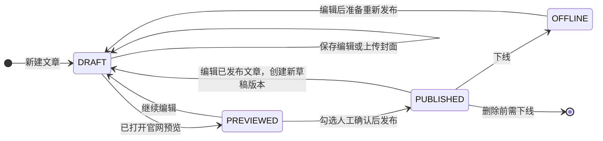
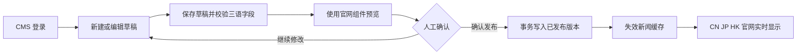
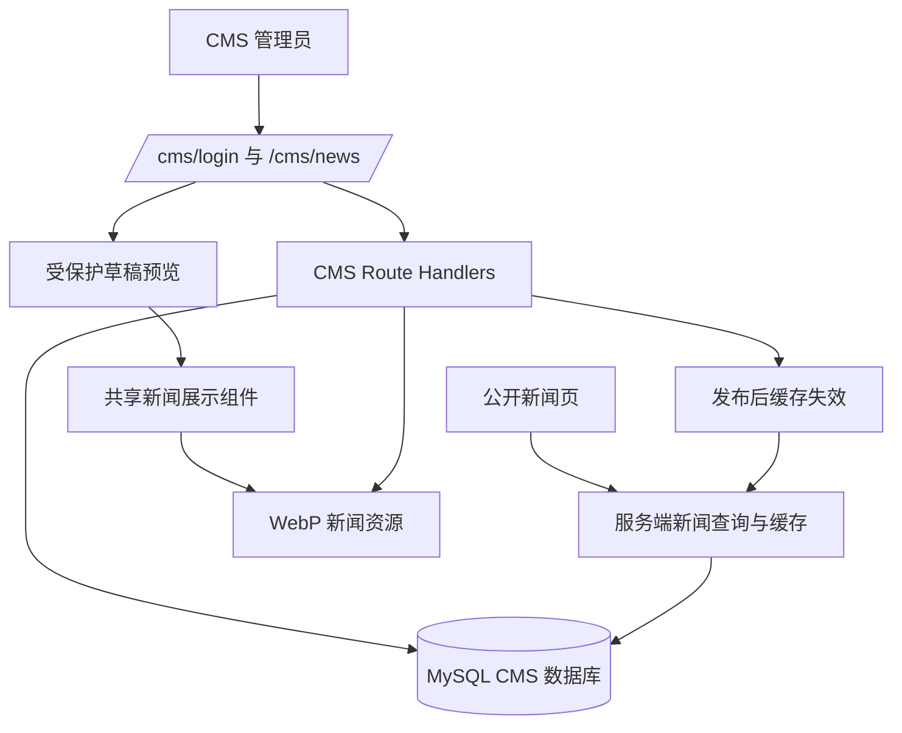

# 新闻中心 CMS 与性能优化设计

| 项目 | 内容 |
| --- | --- |
| 版本 | V2.0 |
| 日期 | 2026-07-13 |
| 范围 | 新闻前台性能优化、独立 CMS 登录与新闻管理 |
| 决策 | 采用官网内置轻量 CMS，发布实时生效 |

## 1. 背景与目标

当前新闻数据写在 `lib/news-content.ts`，官网以纯静态方式导出。新闻页慢感的主要来源是未优化的 PNG 封面（当前新闻资源约 28 MB）和客户端携带的完整文章数据，而不是静态内容本身。

新媒体部门后续需要独立维护新闻，工作流已经明确为“编辑草稿、预览官网效果、人工确认、实时发布”。第一期只有一个独立 CMS 管理员，不复用财税产品的账号、权限、登录入口或业务数据。

本项目同时达成以下目标：

1. 将新闻封面与数据加载优化，保持三站新闻访问速度和 SEO 可用性。
2. 提供独立登录的新闻 CMS，支持草稿、预览、发布、下线、历史版本和操作记录。
3. 将 CN、JP、HK 作为一篇新闻的三个语言版本统一管理，阻止不完整内容被发布。
4. 发布完成后让官网实时读取新版本，不再需要人工改代码、构建或部署。

## 2. 方案比较与结论

### 方案 A：官网内置轻量 CMS（采用）

官网从 `output: 'export'` 迁移为运行在 Node.js 环境的 Next.js 服务。CMS 管理页、预览页、公开新闻页共用同一套新闻展示组件；CMS 通过独立 cookie 会话保护，公开页仅查询已发布版本。发布提交后清除新闻缓存，下一次访问立即获得新内容。

优点：预览与官网真实效果一致；发布实时生效；新闻数据不再进入大客户端包；只维护一个仓库和一套展示组件。代价：生产环境需要提供 Node.js 服务、持久化 MySQL 和上传文件存储，不能继续只部署 `dist` 静态目录。

### 方案 B：在账大师 GoFrame 后端新增 CMS 模块

可以复用另一仓库的服务与数据库能力，但新闻 CMS 与官网前台分属两个仓库，草稿预览难以复用真实组件，也增加跨仓库联调与发布顺序。本轮不采用。

### 方案 C：CMS 发布触发静态构建

可保留纯静态托管，但发布需要等待构建和部署完成；草稿预览也需要额外预览构建，不符合实时发布诉求。本轮不采用。

## 3. 产品流程与状态

### 3.1 角色与权限

| 角色 | 登录入口 | 权限 |
| --- | --- | --- |
| CMS 管理员 | `/cms/login` | 管理新闻、上传封面、保存草稿、预览、发布、下线、查看版本和操作日志、修改自己的密码 |
| 公众访客 | `/cn/news/`、`/jp/news/`、`/hk/news/` | 仅访问已发布文章 |

初始管理员由部署环境变量创建；账号和密码哈希保存于独立 CMS 数据表。登录成功后使用仅限 CMS 路径的 `HttpOnly`、`Secure`、`SameSite=Lax` cookie。CMS 会话、账号和内容数据均不接入财税产品账号体系。

### 3.2 新闻生命周期

同一文章只能有一个线上已发布版本。编辑线上文章不会覆盖公开内容，而是创建新的草稿版本；草稿发布成功前，官网始终展示上一已发布版本。管理员必须完成一次预览，并在发布对话框明确勾选“我已人工审核当前三语内容和封面效果”，发布按钮才可用。

### 3.3 主流程

## 4. 系统架构与数据流

- CMS 页面放在本仓库的 `app/cms/`，不加入官网公共导航，也不被搜索引擎收录。
- CMS API 放在 `app/api/cms/`；公开新闻数据不提供草稿读取接口。
- 公开新闻列表与详情页改为服务端读取已发布内容，按新闻标签缓存；发布、下线、回滚后精准失效缓存。
- 新闻显示组件从当前巨型 `OfficialSite` 中抽出，列表、详情和草稿预览共同使用，避免预览与官网样式不一致。
- 生产环境启用 Next.js 图片优化；CMS 上传封面时额外生成 WebP 主图和卡片缩略图。原始上传文件保留，线上页面只消费优化资源。

## 5. 数据设计

### 5.1 核心表

| 表 | 关键字段 | 说明 |
| --- | --- | --- |
| `cms_admin` | `id`、`username`、`password_hash`、`last_login_at`、`is_active` | 独立 CMS 管理员；第一期只允许一条启用记录 |
| `cms_session` | `id`、`admin_id`、`token_hash`、`expires_at`、`revoked_at` | 不在数据库保存明文会话 token |
| `news_article` | `id`、`slug`、`status`、`published_version_id`、`published_at`、`offline_at` | 文章稳定身份、公开路径和当前线上版本 |
| `news_version` | `id`、`article_id`、`version_no`、`state`、`cover_asset_id`、`reviewed_at`、`created_by` | 草稿、已发布和历史快照；不可原地覆盖已发布版本 |
| `news_locale_content` | `version_id`、`locale`、`title`、`summary`、`lead`、`sections_json`、`closing_json`、`category`、`tags_json` | 同一版本下 CN、JP、HK 三语内容 |
| `cms_asset` | `id`、`original_url`、`webp_url`、`thumbnail_url`、`width`、`height`、`size_bytes` | 封面资产与优化结果 |
| `cms_audit_log` | `id`、`admin_id`、`action`、`target_type`、`target_id`、`detail_json`、`created_at` | 登录、保存、预览、发布、下线、回滚、改密等追溯记录 |

`slug` 全局唯一且发布后不可直接修改；日期、分类、标签以版本字段维护。`sections_json` 和 `closing_json` 保持当前文章段落结构，迁移后不改变前台正文事实。

### 5.2 迁移与回退

首次上线前将当前 `lib/news-content.ts` 的 17 篇 CN、JP、HK 新闻导入为已发布版本，逐篇校验 slug、日期、分类、标题、摘要、正文和封面。旧代码数据在迁移验收前保留为只读回退源；数据库数据与公开页验证一致后才移除前台对旧数据的依赖。

## 6. 功能需求

### 6.1 独立登录与账户安全

- 登录字段为账号和密码；账号、密码为空或错误时给出统一错误提示，不泄露账号是否存在。
- 密码使用强哈希算法保存，最少 12 位；连续失败 5 次锁定 15 分钟并写审计日志。
- 管理员可在登录后修改密码；修改成功后撤销旧会话并要求重新登录。
- 登录、退出、改密、锁定和解锁均写操作日志。

### 6.2 新闻列表与筛选

- CMS 默认展示全部文章，包含状态、最近修改时间、发布日期、三语完整度、封面缩略图和最近操作人。
- 支持按草稿、已发布、已下线和关键词筛选；空列表显示创建入口。
- 下线文章不再出现在公开列表和详情页，历史版本与操作日志保留。

### 6.3 草稿编辑

- 新建时填写固定 slug、发布日期、封面、分类、标签和 CN、JP、HK 内容。
- 每种语言必须填写标题、摘要、导语、正文分节和结语；缺失字段明确标红，不能进入发布确认。
- 自动保存失败时保留本地未提交提示，网络恢复后允许手动重试；服务端使用版本号防止覆盖更新。
- 已发布文章进入编辑时创建新的草稿版本，禁止直接改线上版本。

### 6.4 封面上传与性能优化

- 接受 JPEG、PNG、WebP，单文件最大 10 MB；拒绝不安全 MIME 类型和损坏图片。
- 服务端校验图片实际格式，生成最长边不超过 1600px 的 WebP 主图与 960px 卡片缩略图，保留原文件以便回退。
- 发布前校验封面已生成优化版本；公开卡片使用缩略图，详情页使用主图。
- 既有新闻封面批量迁移为 WebP，目标将当前引用新闻资源总体积降低至少 70%。

### 6.5 预览、审核与发布

- 草稿预览地址仅在 CMS 登录会话内可访问，响应添加 `noindex, nofollow` 和禁止共享缓存头。
- 预览复用公开新闻详情组件，同时可切换 CN、JP、HK 和桌面、平板、手机宽度。
- 发布前必须成功预览当前草稿版本且勾选人工审核确认；任何语言不完整、封面未优化、slug 冲突或版本过期均阻止发布。
- 发布用单个数据库事务更新文章当前版本和状态；成功后失效新闻列表、首页新闻摘要、三站详情页缓存，返回可复制的线上链接。
- 发布失败时保持线上旧版本和草稿，前台不出现半发布状态。

### 6.6 下线、历史版本与回滚

- 下线需要二次确认；下线后公开页返回 404，不删除数据库内容。
- 每次保存形成可追溯版本；管理员可预览历史版本并将任意历史版本复制为新草稿后重新发布。
- 删除仅限尚未发布的草稿；已发布或已下线文章只能保留或恢复。

## 7. 前台性能与 SEO

- 移除 `next.config.mjs` 的静态导出配置，服务端渲染新闻列表和详情页；不将完整三语文章正文打入新闻列表客户端。
- 新闻列表只传递卡片字段；分类筛选优先服务端完成，必要的轻交互局部客户端化。
- 使用缓存标签和发布后按需失效，常规访问走缓存；数据库或缓存故障时继续返回最近一次可用的已发布内容，并记录服务端错误。
- 公开详情页输出对应语言的标题、描述、OG 图片和 canonical；草稿预览不输出公开 SEO 元数据。
- 首屏仅提升第一张封面的加载优先级，其他封面延迟加载与异步解码。

## 8. 非功能需求与验收

| 领域 | 验收标准 |
| --- | --- |
| 实时性 | 发布成功后 30 秒内，三站新闻列表、首页新闻摘要和详情页可见新版本；下线后 30 秒内不可公开访问 |
| 性能 | 公开新闻列表首屏不下载非首屏封面；新闻封面引用资源总体积较当前降低至少 70% |
| 安全 | 未登录请求不能读取草稿、预览、CMS API 或审计日志；密码和会话 token 不以明文入库或出现在日志中 |
| 一致性 | 所有公开新闻只读取 `PUBLISHED` 当前版本；发布失败时线上内容不改变 |
| 三语 | 每篇发布文章均有 CN、JP、HK 完整内容，三个站点共享同一 slug、发布日期和封面 |
| 兼容性 | 在 390px、768px、1440px 验证 CMS 预览与公开新闻页；中文无乱码、无 emoji、无内部开发措辞 |
| 回归 | `npm run build`、CMS 登录/草稿/预览/发布/下线测试通过；现有试用与代理线索接口不受影响 |

## 9. 分阶段交付

### P0：数据和前台性能基础

数据库迁移、现有新闻导入、WebP 批处理、公开新闻服务端读取、缓存失效和三站回归。此阶段完成后，新闻访问性能改善，但仍不开放新媒体编辑入口。

### P1：CMS 核心发布闭环

独立登录、文章列表、草稿编辑、上传封面、真实组件预览、人工确认、发布、下线和操作日志。P1 完成后，新媒体可以独立完成全流程。

### P2：运营增强

历史版本可视化对比、定时发布、素材库复用、更多管理员与审批角色、内容数据报表。P2 不阻塞 P0/P1 上线。

## 10. 实施前置条件与待确认项

以下事项不改变已确定的产品方案，但需要在部署前落实：

1. **生产 Node.js 服务**：需要提供能够持续运行 Next.js 服务的部署位置和反向代理，纯 `dist` 静态托管不能满足实时 CMS。
2. **MySQL 连接**：需要单独的 CMS 数据库或独立 schema、连接地址、账号和备份策略；不得直接与财税业务表混用。
3. **图片存储**：生产需要持久化对象存储或挂载持久卷，并提供上传访问凭证；本地开发可使用受控本地目录。
4. **初始管理员凭证**：账号和初始密码通过部署环境变量注入，不能写入仓库或公开配置。
5. **域名与反向代理**：确认 CMS 使用同域 `/cms/` 还是独立子域；本设计默认同域路径，不在官网导航显示。

## 11. 变更边界与回退

- 不改动现有试用、代理合作、产品登录和其他官网页面的功能逻辑。
- 不修改已发布新闻的事实内容、三语文案、日期或 slug；只迁移数据源和优化封面资源。
- 公开页切换到数据库前完成数据逐篇比对；出现异常时可临时切回 `lib/news-content.ts` 只读数据源。
- 发布和缓存失效采用事务与失败回滚，避免出现单站更新、草稿泄露或半发布。
