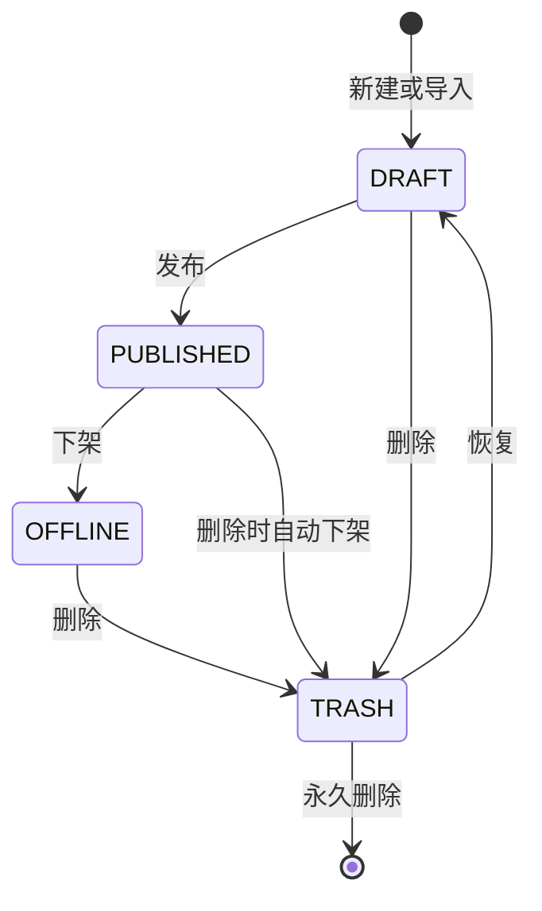

# 新闻 CMS 稿件工作台设计

| 项目 | 内容 |
| --- | --- |
| 版本 | V3.0 |
| 日期 | 2026-07-13 |
| 范围 | 新闻稿件后台、分类、正文内容块、排序、翻译、工作台接入与生产部署 |
| 已确认 | 中文源稿、一键翻译、Vercel + Neon Postgres + Vercel Blob |

## 1. 目标与边界

将现有“单页列表、三语手填”的轻量 CMS 升级为可部署、可运营的稿件工作台。新媒体管理员在网页中完成稿件创建、编辑、翻译、预览、发布、下架、删除、恢复与排序；公众只读取已发布版本。

本期不接入新媒体工作台的真实调用。CMS 先定义稳定的数据模型和受保护的导入接口，待功能完成后输出字段与接口清单供对方适配。

## 2. 信息架构与交互

CMS 采用任务型工作台，而非单页长表单。

- 左侧工作区：草稿、已发布、已下架、回收站。
- 顶部工具栏：关键词搜索、发布日期区间、分类、标签、置顶状态筛选；筛选条件可组合并保留在 URL 查询参数中。
- 列表：显示标题、分类、发布日期、标签、译文状态、最近修改时间、状态和排序标识。
- 编辑器：基础信息、封面、正文内容块、翻译、发布设置和操作记录分区呈现；窄屏下变为顺序区块。
- 已发布工作区额外出现“置顶与排序”模式；拖拽只影响已发布文章，草稿、下架和回收站不参与前台排序。

日期使用日期选择器。分类使用可搜索的选择器，不允许任意文本直接成为正式分类。

## 3. 稿件状态与删除规则

- 所有删除先软删除至回收站。
- 删除已发布稿件时，先以事务清除公开版本和排序资格，再进入回收站。
- 从回收站恢复一律恢复为草稿，不自动上线。
- 永久删除仅允许在回收站执行，并需要二次确认。
- 已发布稿件的编辑始终生成新草稿版本，线上版本不会被原地覆盖。

## 4. 分类管理

分类是独立实体，包含名称、slug、状态、排序和来源。

- 管理员可新建、改名、停用、恢复和合并分类。
- 被稿件引用的分类不能直接永久删除；可停用或合并至目标分类。
- 导入接口收到未注册分类时，系统自动创建为启用分类，来源标记为 `IMPORT`，并在稿件编辑器显示“已自动创建新分类”。
- 导入未传分类时，稿件保持草稿并显示“待填写分类”，不得发布。

## 5. 正文内容块与素材

正文使用有序内容块替代固定的“标题 + 段落数组”。首期支持：

| 块类型 | 字段 | 说明 |
| --- | --- | --- |
| `SECTION` | 标题、段落数组 | 常规文字分节 |
| `IMAGE` | 素材、图片说明 | 正文独立配图 |
| `IMAGE_SECTION` | 标题、段落数组、素材、图片说明 | 图文分节 |

- 内容块支持拖拽排序、键盘排序、复制、删除和插入。
- 每个拖拽操作写入草稿，保存时以 `position` 作为稳定顺序。
- 图片上传至 Vercel Blob；数据库保存素材元数据、访问 URL、宽高、替代文本与归属。
- 封面和正文图片复用素材表，但使用不同用途标识。

## 6. 中文源稿与翻译

中文是唯一源稿。日文和繁体中文不是必填手工源稿，而是中文草稿的可编辑译文。

1. 保存中文草稿不会自动请求翻译。
2. 管理员点击“一键翻译”后，服务端创建日文、繁体中文翻译任务并生成对应内容块。
3. 中文在译后发生变化时，日文、繁体中文状态变为“源稿已变化，需重新翻译”。
4. 管理员可人工修改任一译文；再次翻译前须选择“覆盖”或“仅翻译未修改块”。
5. 发布要求中文完整且两种译文均已成功生成；界面显示“机器翻译”或“已人工修改”，不强制双语人工审核。
6. 翻译失败保留中文草稿和现有译文，不改变公开版本。

翻译由服务端适配器调用，使用环境变量选择供应商、模型和密钥。供应商实现不进入浏览器；首期接口输出遵循结构化 JSON，允许后续在不改业务表结构的情况下切换翻译服务。

## 7. 已发布排序与置顶

仅状态为 `PUBLISHED` 的稿件拥有排序资格。

前台及 CMS 已发布列表使用同一排序：

1. `is_pinned = true` 的稿件按 `pinned_position` 升序；
2. 其他稿件按 `manual_position` 升序；
3. 未设手动顺序时按 `published_at` 倒序；
4. 最后以 `id` 作为稳定兜底排序。

“一键置顶”将稿件置于置顶组首位；置顶组内部支持拖拽。取消置顶后回到非置顶手动顺序。下架、删除或恢复都会移除排序资格，恢复为草稿后需重新发布才进入前台排序。

## 8. 数据模型

生产数据库使用 Neon Postgres，SQLite 仅保留本地开发迁移工具，不作为线上运行时存储。

| 表 | 关键字段 | 责任 |
| --- | --- | --- |
| `cms_admin` | `id`、`username`、`password_hash`、`is_active` | 管理员账号 |
| `cms_session` | `admin_id`、`token_hash`、`expires_at`、`revoked_at` | CMS 会话 |
| `news_category` | `id`、`name`、`slug`、`status`、`source`、`sort_order` | 分类主数据 |
| `news_article` | `id`、`slug`、`status`、`category_id`、`published_at`、`deleted_at`、`is_pinned`、`pinned_position`、`manual_position` | 稿件稳定身份、状态和发布排序 |
| `news_version` | `article_id`、`version_no`、`state`、`source_version_id`、`created_by` | 草稿、发布和历史版本 |
| `news_locale_content` | `version_id`、`locale`、`title`、`summary`、`lead`、`closing`、`translation_status`、`source_hash` | 中文源稿与各语言文本 |
| `news_content_block` | `locale_content_id`、`type`、`position`、`payload_json` | 有序正文内容块 |
| `cms_asset` | `blob_url`、`mime_type`、`width`、`height`、`alt_text`、`usage` | 封面和正文图片素材 |
| `translation_job` | `version_id`、`target_locale`、`status`、`provider`、`model`、`error_code` | 翻译可追溯性与重试 |
| `integration_delivery` | `source`、`external_id`、`idempotency_key`、`payload_hash`、`result` | 新媒体工作台导入幂等控制 |
| `cms_audit_log` | `admin_id`、`action`、`target_type`、`target_id`、`detail_json` | 管理操作审计 |

所有公开读取只查询 `PUBLISHED` 当前版本。分类、稿件状态、排序和发布切换都使用数据库事务，防止出现半发布或重复排序。

## 9. 预留的新媒体工作台接入

后续对外发布一份版本化接口清单，最小导入能力为：

- `POST /api/integrations/news/drafts`
- 请求头：签名、时间戳、幂等键。
- 核心字段：外部稿件 ID、中文标题、摘要、导语、发布日期、分类、标签、封面、正文内容块与来源链接。
- 返回：CMS 稿件 ID、slug、分类创建标记、字段校验结果和可编辑后台地址。

导入 API 只创建或更新草稿，不允许外部系统直接发布、下架、删除或调整前台排序。

## 10. 生产部署

- Vercel 部署 Next.js CMS 页面、Route Handlers 和公开新闻页。
- Neon Postgres 保存关系型数据；通过 Vercel Marketplace 注入连接环境变量。
- Vercel Blob 存放封面和正文图片；仅服务端持有写入令牌。
- 翻译服务密钥、导入签名密钥、CMS 初始管理员凭据均放在 Vercel 环境变量，禁止写入仓库、数据库日志或浏览器。
- 发布、下架、排序和分类变更后，按标签失效 CN、JP、HK 新闻列表、详情和首页新闻缓存。

## 11. 验收标准

- 分类、发布日期均通过选择控件操作；分类可完整管理，未知导入分类自动创建并提示。
- 正文可插入图片块、拖拽排序并在三站预览中正确呈现。
- 一键翻译仅在管理员触发时调用；中文变化后译文状态准确变化。
- 草稿、已发布、已下架、回收站均独立展示；搜索与全部筛选可组合。
- 只有已发布稿件可置顶或调整前台顺序。
- 删除、恢复、永久删除、发布、下架和排序均写审计记录。
- Vercel 生产环境不依赖本地 SQLite；数据库、图片和翻译密钥均可通过环境变量安全配置。

## 12. 不在本期范围内

- 多级审批、多人协同编辑、定时发布和内容数据报表。
- 新媒体工作台的真实接口联调。
- 人工翻译审校工作流、术语审核台和翻译记忆库。

## 13. 当前实施状态

- 本地验收版已完成四个稿件工作区、组合筛选、分类创建与启停、软删除/恢复/永久删除、发布后置顶和拖拽排序。
- 编辑器已使用日期与分类选择控件，正文分节支持图片上传与拖拽排序；分类为空时会在发布检查中阻止发布。
- 一键翻译已接入可配置的服务适配层：未配置 API 时返回可执行的配置提示，配置后一次生成日文与繁体草稿，仍需人工审核后发布。
- 当前 SQLite 与本地图片目录仅用于开发验收。部署到 Vercel 前必须完成 Neon PostgreSQL、Vercel Blob 与翻译服务环境变量配置；外部工作台导入接口在字段契约确定后再接入。

## 14. 外部工作台导入接口（已预留）

- 地址：`POST /api/integrations/news/import`。
- 认证：`Authorization: Bearer <CMS_IMPORT_SHARED_SECRET>`，密钥仅由服务端保存。
- 请求体包含 `sourceId` 与三语 `content`；其中 `content.cn.slug` 必填。重复 slug 会更新草稿，不会直接覆盖线上已发布版本。
- 若 `content.cn.category` 是新名称，CMS 自动创建来源为 `IMPORT` 的分类并在响应中提示；未传分类时保留空值并返回待补充提示。
- 外部接口只能创建或更新草稿，不能发布、下架、删除、置顶或调整排序。
