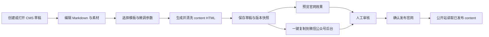
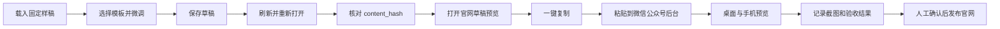

# CMS 微信兼容排版与统一发布字段设计

| 项目 | 内容 |
| --- | --- |
| 版本 | V1.0 |
| 日期 | 2026-07-16 |
| 状态 | 设计已固化，等待实现与端到端效果验收 |
| 适用范围 | 新闻 CMS 排版、官网预览与发布、微信公众号富文本复制、未来新媒体工作台对接 |
| 验收方式 | 以官网实际展示和微信公众号后台实际粘贴结果为准 |

## 1. 背景与决策

现有新闻 CMS 已具备独立登录、三语稿件、图片上传、草稿、预览、人工审核、官网发布、版本和操作日志，但正文仍以“分节标题、段落数组、单图”为主，无法统一表达复杂文本、图片、代码、表格、引用和排版模板。

本功能是过渡期发布板块。CMS 仍只负责官网草稿与官网发布，不在本期直接调用微信公众号接口。为了减少新媒体人员的重复排版工作，CMS 排版结果必须能够一键复制到微信公众号后台，并尽量保持正文结构、图片顺序和视觉样式不需要人工修复。

后续新媒体工作台自行适配各发布平台，不要求其采用 CMS 的内部编辑源格式。CMS 对外只提供稳定、版本化、与微信公众号草稿字段语义一致的发布契约和接口清单。

本设计采用以下决策：

1. `content` 是最终发布正文，保存经过清洗、内联样式化的 HTML 快照。
2. `source_markdown` 是 CMS 重新编辑所需的内部字段，不是未来上游系统的必填字段。
3. 官网预览、官网正式发布和微信公众号富文本复制复用同一份 `content`，避免三套渲染结果漂移。
4. 微信公众号字段作为发布层主体；CMS、编辑器和素材管理字段放入扩展层。
5. 旧新闻继续使用现有分节结构，不批量重写；新格式以版本字段并行接入，已验证正确的旧内容不受影响。
6. 不复制 TypeZen 的源代码、品牌、文案和模板资产，只独立实现等价的编辑、排版、预览和复制能力。

## 2. 目标与非目标

### 2.1 产品目标

- 新媒体人员在 CMS 完成文字、图片、代码、表格和模板排版后，可直接发布到官网。
- 同一排版结果可一键复制到微信公众号后台，标准验收样稿不需要二次修复。
- 相同内容、模板和参数始终生成相同 HTML，并可通过版本号和哈希追溯。
- 后续提供清晰的字段、素材、校验、错误码、幂等和示例清单，供新媒体工作台点对点接入。
- 保留现有三语、草稿、预览、人工审核、发布、下架和审计流程。

### 2.2 本期范围

- Markdown 编辑、工具栏快捷插入、实时预览和字数统计。
- 标题、段落、换行、加粗、斜体、删除线、高亮、上下标、链接、列表、引用、代码、表格、分隔线、图片和连续多图。
- 图片上传、粘贴图片、在线图片、替代文字、图片说明和正文素材引用。
- 微信兼容 HTML 渲染、清洗、内联样式、一键复制和纯文本降级。
- 六类风格、共 72 个独立设计的模板预设，以及字号、行高、段间距、首行缩进、页面留白、字间距、图片圆角、主题色和标题布局微调。
- AI 结构整理：只调整 Markdown 结构，不删除、不增补、不润色原文；结果必须先预览差异再由管理员接受。
- 新格式的保存、重新打开、版本快照、官网预览、官网发布和历史内容兼容。
- 未来接口所需字段与交付清单固化。

### 2.3 不在本期范围

- 直接创建、更新或发布微信公众号草稿。
- 微信公众号 `access_token`、AppID、AppSecret 和素材 Media ID 的真实联调。
- 新媒体工作台的真实接入改造。
- 多人同时编辑、评论批注、多级审批、定时发布和内容数据报表。
- 模板市场、用户自定义脚本、任意 HTML 或任意 CSS。

## 3. 角色与主流程

### 3.1 角色

| 角色 | 权限 |
| --- | --- |
| CMS 管理员 | 创建和编辑草稿、上传素材、选择模板、AI 整理、预览、复制、人工确认、官网发布、下架和查看日志 |
| 官网访客 | 只读取已发布版本 |
| 未来新媒体工作台 | 按版本化字段契约创建或更新 CMS 草稿，不直接发布官网 |

### 3.2 主流程



微信公众号粘贴验证是版本交付验收的一部分，但不是每篇官网新闻运行时发布的强制步骤。CMS 仍保持“草稿、预览、人工确认、官网发布”的既有门禁。

## 4. 总体架构与组件边界

| 组件 | 责任 | 不负责 |
| --- | --- | --- |
| `CmsFormattingEditor` | Markdown 输入、工具栏、图片插入、模板和参数操作、未保存状态 | 最终 HTML 安全策略 |
| `PublicationRenderer` | Markdown 解析、模板套用、内联样式、确定性 HTML 生成 | 草稿状态和数据库写入 |
| `PublicationSanitizer` | 标签、属性、URL 和样式白名单清洗 | 改写文章内容 |
| `PublicationValidator` | 字段长度、HTML 体积、图片、链接、兼容性和发布准备度校验 | 自动修复有歧义的内容 |
| `ClipboardPublisher` | 同时写入 `text/html` 与 `text/plain`，失败时降级并提示 | 微信接口调用 |
| `CmsAssetService` | 图片上传、尺寸和哈希记录、正文引用、未来微信地址映射 | 保存微信密钥 |
| `WebsiteArticleRenderer` | 在官网内容容器中安全输出发布快照 | 重新解释 Markdown |
| `AiStructureFormatter` | 服务端调用模型整理结构、返回差异结果 | 自动覆盖原稿或润色内容 |
| `PublicationContractAdapter` | 未来外部请求的版本、幂等、字段映射和错误码 | 直接绕过人工审核发布 |

各组件通过稳定输入输出通信。`PublicationRenderer` 和 `PublicationSanitizer` 不依赖 React 页面，可独立测试；官网页面不自行实现第二套 Markdown 解析逻辑。

## 5. 统一发布字段契约

### 5.1 契约外壳

```json
{
  "schema_version": "publication-draft.v1",
  "source_system": "cms",
  "external_id": "article-123",
  "idempotency_key": "article-123-v5",
  "articles": [
    {
      "article_type": "news",
      "title": "文章标题",
      "author": "账大师",
      "digest": "文章摘要",
      "content": "<section style=\"...\">最终发布正文</section>",
      "content_source_url": "https://example.com/cn/news/example/",
      "thumb_media_id": null,
      "need_open_comment": 0,
      "only_fans_can_comment": 0,
      "pic_crop_235_1": null,
      "pic_crop_1_1": null,
      "extensions": {
        "editor": {},
        "cms": {},
        "assets": []
      }
    }
  ]
}
```

### 5.2 字段分层

| 层级 | 字段 | 规则 |
| --- | --- | --- |
| 传输层 | `schema_version` | 必填；首版固定为 `publication-draft.v1`，破坏性调整必须升级主版本 |
| 传输层 | `source_system` | 必填；标识 CMS 或未来新媒体工作台 |
| 传输层 | `external_id` | 外部系统必填且稳定；CMS 手工稿由系统生成 |
| 传输层 | `idempotency_key` | 外部写入必填；同键同载荷返回原结果，同键不同载荷拒绝 |
| 发布层 | `article_type` | 本期只接受 `news`；为未来图片消息保留枚举空间 |
| 发布层 | `title` | 必填；按微信公众号口径校验不超过 32 字 |
| 发布层 | `author` | 可选；不超过 16 字 |
| 发布层 | `digest` | 可选；不超过 120 字；CMS 不依赖微信自动截取 |
| 发布层 | `content` | 必填；最终内联样式 HTML，是官网和复制的共同发布快照 |
| 发布层 | `content_source_url` | 可选；官网公开地址或来源页 |
| 封面层 | `thumb_media_id` | 本期允许为空；未来微信 API 准备度校验时必填 |
| 封面层 | `pic_crop_235_1`、`pic_crop_1_1` | 可选；遵循微信坐标字符串语义 |
| 互动层 | `need_open_comment` | `0` 或 `1`，默认 `0` |
| 互动层 | `only_fans_can_comment` | `0` 或 `1`，默认 `0`；关闭评论时不产生实际作用 |
| 编辑扩展 | `source_markdown` | CMS 内部重新编辑源；外部调用可不传 |
| 编辑扩展 | `template_id`、`style_config` | 模板稳定标识和微调参数 |
| 编辑扩展 | `render_version`、`content_hash` | 渲染器版本和最终 HTML 的 SHA-256 |
| CMS 扩展 | `slug`、`locale`、`category_id`、`tags` | 官网路由、三语、分类和标签 |
| CMS 扩展 | `seo_title`、`seo_description` | 官网搜索展示字段，不映射微信 |
| CMS 扩展 | `status`、`version_no`、`previewed_at` | CMS 流程字段，不允许外部直接指定为已发布 |

微信公众号当前草稿字段和限制以官方文档为基准：

- 新建草稿：<https://developers.weixin.qq.com/doc/service/api/draftbox/draftmanage/api_draft_add>
- 上传图文消息图片：<https://developers.weixin.qq.com/doc/service/api/material/permanent/api_uploadimage>

官方字段变化不直接修改历史快照。适配器升级后必须增加 `render_version` 或契约版本，并用回归样稿验证。

### 5.3 素材字段

```json
{
  "asset_id": "asset-001",
  "type": "image",
  "original_url": "https://example.com/source.png",
  "cms_public_url": "https://example.com/cms/image.webp",
  "wechat_url": null,
  "wechat_media_id": null,
  "alt_text": "图片说明",
  "caption": "可选图片说明",
  "width": 1200,
  "height": 800,
  "mime_type": "image/webp",
  "content_hash": "sha256-value"
}
```

- 保存和复制前，粘贴图片、拖入图片和本地图片必须先上传为 CMS 公网资源，不允许把临时 `blob:` URL 写入草稿。
- `original_url` 只用于追溯，官网正文使用 `cms_public_url`。
- `wechat_url` 和 `wechat_media_id` 本期为空；未来直连微信时由素材适配器写入，不改变编辑源和正文顺序。
- 相同图片可以用 `content_hash` 去重，但不得因去重删除文章与素材之间的引用记录。

## 6. 内容元素与渲染口径

### 6.1 支持元素

| 内容类型 | 编辑能力 | 发布要求 |
| --- | --- | --- |
| 普通段落与换行 | Markdown 输入、回车、软换行 | 保持文本顺序和可复制换行 |
| 一至六级标题 | 工具栏和 Markdown | 模板可分别定义视觉样式，层级不得被 AI 随意改变 |
| 加粗、斜体、删除线、高亮 | 选区操作 | 只生成白名单标签和内联样式 |
| 上标、下标 | 工具栏操作 | 不支持环境需回退为可读文本，不得丢字 |
| 有序、无序列表 | 输入、工具栏、嵌套 | 微信粘贴后序号和层级可读 |
| 引用 | 单段和多段引用 | 不依赖伪元素生成关键文本 |
| 行内代码、代码块 | 语言可选、保留空格换行 | 长行可横向滚动或换行，不撑破移动端 |
| 表格 | 插入和 Markdown | 宽度自适应，单元格不丢失，移动端不溢出正文容器 |
| 链接 | 文本与 URL | 协议白名单；不允许 `javascript:` |
| 图片 | 上传、粘贴、在线地址 | 保存前转为 CMS 资源，必须有替代文字输入能力 |
| 连续多图 | 连续图片自动识别 | 生成微信兼容布局；不依赖外部网格 CSS |
| 分隔线 | 工具栏和 Markdown | 使用稳定标签与内联边框样式 |
| 内嵌 HTML | 只接受安全子集 | 非白名单内容转义或拒绝并显示具体位置 |

### 6.2 HTML 与样式安全边界

初始标签白名单包括：`section`、`p`、`span`、`strong`、`em`、`s`、`br`、`h1` 至 `h6`、`blockquote`、`ul`、`ol`、`li`、`pre`、`code`、`table`、`thead`、`tbody`、`tr`、`th`、`td`、`img`、`a` 和 `hr`。最终白名单以微信公众号实际粘贴回归结果收紧，不因某标签浏览器可显示就默认允许。

禁止内容包括：

- `script`、`style`、`iframe`、`object`、`embed`、表单和可执行 SVG。
- `on*` 事件属性、`javascript:` URL、内联脚本和任意数据执行入口。
- 依赖外部 CSS 类名、ID 选择器、伪元素或运行时 JavaScript 才能显示的正文内容。
- 把关键文本放在背景图、伪元素或不可访问属性中。

允许样式只覆盖排版所需的颜色、背景、字体、字号、字重、行高、字间距、对齐、留白、边框、圆角、宽度、最大宽度和安全布局属性。每个允许属性及值域必须在代码中形成白名单并有单元测试。

### 6.3 确定性渲染

`content` 必须由以下输入唯一决定：

```text
source_markdown
+ template_id
+ style_config
+ asset mappings
+ render_version
= content
+ content_hash
```

保存草稿时生成 `content` 和 `content_hash`。重新打开但未修改内容时不得重新生成不同 HTML。模板以后发生更新，也不能改变已经发布的旧快照；编辑旧稿并主动应用新版模板时才生成新草稿版本。

## 7. 模板与微调系统

- 提供六类风格、共 72 个模板预设；模板必须独立设计，不复制参考产品资产。
- 模板使用数据配置和渲染函数组合，不创建 72 份重复页面代码。
- `template_id` 永久稳定；模板显示名称可以调整，但 ID 不复用。
- 模板更新必须增加 `template_version`，历史发布快照继续保留原 HTML。
- 微调字段至少包括：正文字号、行高、段间距、首行缩进、上下左右留白、字间距、图片圆角、主题色、一级标题布局和二级标题布局。
- 切换模板或参数后实时预览；恢复默认值只恢复当前模板默认值，不清空正文和素材。
- 深色模式只影响 CMS 工作台，不改变发布正文的颜色结果。

## 8. 一键复制规则

1. 复制前重新执行发布校验，但不静默修改正文。
2. 优先通过 Clipboard API 同时写入 `text/html` 和 `text/plain`。
3. HTML 内容只复制文章正文，不复制 CMS 按钮、预览外框和官网导航。
4. 纯文本回退保留标题、段落、列表、链接地址和图片替代文字。
5. 浏览器拒绝剪贴板权限时，显示明确错误和可操作的手动复制区域。
6. 复制成功只代表内容已写入剪贴板，不宣称微信公众号已经保存成功。
7. 任何未完成上传的本地图片都会阻止“可复制”状态，并定位到具体图片。

## 9. AI 结构整理

- AI 只处理 Markdown 结构，包括标题层级、空行、列表、引用、加粗和分隔线。
- 系统提示词明确禁止删除、增补、润色、改写、翻译和改变事实。
- 模型密钥保存在服务端环境变量，不进入浏览器、本地存储、数据库正文或日志。
- AI 返回结果先展示差异；管理员接受后才替换编辑源，并可在保存前撤销。
- 调用失败、超时或返回非法结构时保留原稿，显示错误，不创建空版本。
- AI 结果仍须经过同一渲染、清洗和发布校验流程，不获得绕过权限。

## 10. 数据兼容与迁移

### 10.1 新旧格式并行

在现有文章内容中增加可选字段，不删除原有 `sections` 和 `closing`：

```ts
type PublicationBody = {
  format: 'legacy-sections' | 'wechat-html-v1'
  sourceMarkdown?: string
  contentHtml?: string
  templateId?: string
  templateVersion?: string
  styleConfig?: Record<string, string | number | boolean>
  renderVersion?: string
  contentHash?: string
  assets?: PublicationAsset[]
}
```

- 旧文章没有 `PublicationBody` 时继续走现有官网渲染逻辑。
- 新文章和主动迁移的文章使用 `wechat-html-v1`。
- 不做自动批量迁移，不因上线新编辑器重写 17 篇或其他历史新闻。
- 单篇旧稿迁移时先生成新草稿，官网线上版本保持不变，预览并人工确认后才能发布。
- CN、JP、HK 各语言拥有独立编辑源和发布 HTML，但共享文章身份、封面素材和流程状态。

### 10.2 版本与审计

- 每次保存生成或更新草稿版本；正式发布固定当前 `content`、`content_hash`、模板和渲染器版本。
- 任何正文、模板、参数或素材变化都会使当前预览状态失效。
- 保存、AI 接受、复制、预览、发布、下架和迁移写入审计日志；日志不记录完整 API 密钥或文章全文。
- 已发布版本不可原地修改；继续编辑始终形成新草稿。

## 11. 校验级别与错误处理

### 11.1 三个准备度

| 准备度 | 必须满足 | 当前用途 |
| --- | --- | --- |
| `CMS_DRAFT_READY` | 基础字段可保存，编辑源和已上传素材可恢复 | 保存草稿 |
| `COPY_READY` | HTML 白名单通过、无临时图片、富文本和纯文本均可生成 | 一键复制微信公众号 |
| `WECHAT_API_READY` | 在 `COPY_READY` 基础上，正文图片已有微信 URL，封面已有永久 Media ID | 未来直连草稿接口 |

本期官网发布不要求 `WECHAT_API_READY`。`thumb_media_id`、`wechat_url` 为空不能阻止保存草稿和官网发布。

### 11.2 失败处理

| 失败场景 | 系统行为 |
| --- | --- |
| Markdown 解析失败 | 保留编辑源，不覆盖上一份有效快照，显示行列或内容片段 |
| HTML 清洗移除了内容 | 阻止复制和发布，列出被移除的标签或属性，不静默丢失正文 |
| 图片上传失败 | 不插入临时地址，保留编辑位置并允许重试 |
| 在线图片不可访问 | 标记具体 URL；允许保存草稿，不允许进入 `COPY_READY` |
| 剪贴板权限失败 | 提供手动复制区域和纯文本降级，不显示“复制成功” |
| AI 调用失败 | 原稿不变，可重试，不影响手工排版和官网发布 |
| 保存冲突 | 返回当前版本号和服务器最新版本，不覆盖他人或另一个标签页的更新 |
| 模板缺失 | 使用草稿快照继续预览；编辑时提示选择可用模板，不替换历史 HTML |
| 发布校验失败 | 保持草稿状态并定位字段、元素或素材 |

## 12. 安全、性能与可访问性

- 所有正文 HTML 在服务端保存前清洗，客户端预览清洗不能替代服务端校验。
- 官网只渲染清洗后的 `content`，禁止使用未审查的任意 HTML。
- 图片上传继续沿用 CMS 身份校验、同源写操作保护、大小和 MIME 校验。
- 初始编辑器交互目标：普通输入和模板微调后的可见预览更新时间不超过 150 毫秒；长文允许使用 300 毫秒防抖。
- 5 万字、50 张图片的压力样稿不得导致浏览器页面崩溃；超过微信兼容限制时必须在复制前提示。
- 编辑控件支持键盘操作；图片需要替代文字输入；颜色模板满足正文可读性要求。
- 中文、日文和繁体中文保存、重新打开、复制与官网展示不得出现乱码。

## 13. 端到端效果验收

用户不需要提前审核内部字段设计。最终以固定样稿在真实 CMS、官网和微信公众号后台的结果验收。

### 13.1 固定回归样稿

至少维护以下样稿，不使用临时手工文本代替：

1. 纯文字长文：六级标题、长段落、换行、强调、高亮和分隔线。
2. 列表与引用：嵌套有序列表、无序列表、多段引用。
3. 代码文章：行内代码、中文注释代码块、长代码行和特殊字符。
4. 表格文章：多列表格、长单元格、移动端窄屏。
5. 图片文章：单图、连续三图、不同宽高比、替代文字和图片说明。
6. 链接文章：官网链接、阅读原文链接、非法协议拦截。
7. 多语言文章：简体中文、繁体中文、日文及中英文混排。
8. 极限文章：接近字符、HTML 体积和素材数量限制。

### 13.2 验收步骤



### 13.3 必须通过的结果

- 文本内容、顺序、标点和语言字符 100% 保留，无乱码。
- 标题层级、列表层级、引用、表格、代码块和图片数量、顺序 100% 保留。
- 保存并重新打开后，未修改输入的 `content_hash` 不变。
- 标准样稿粘贴到微信公众号后台后不需要重新排版；平台字体或容器宽度造成的自然差异可接受。
- CMS 预览和官网正式页使用同一正文快照，不能出现“预览正确、发布变样”。
- 官网桌面和移动端无横向页面溢出；代码和表格使用局部滚动或安全换行。
- 每个失败用例能定位到字段、元素或素材，不只返回“操作失败”。
- 构建、类型检查、CMS 登录、保存、预览、复制和官网发布回归全部通过。

端到端验收记录应包含：样稿版本、浏览器版本、模板 ID、渲染器版本、`content_hash`、官网截图、微信公众号编辑器截图、手机预览截图、失败项和处理结果。

## 14. 未来接口交付清单

新媒体工作台开始对接前，必须一次性交付以下材料：

| 交付物 | 内容 |
| --- | --- |
| OpenAPI 文档 | 接口地址、方法、认证、请求、响应、状态码和示例 |
| JSON Schema | `publication-draft.v1` 的必填、类型、枚举、长度和嵌套结构 |
| 字段映射表 | 新媒体字段、统一发布字段、CMS 字段、微信公众号字段的点对点关系 |
| HTML 白名单 | 允许标签、属性、URL 协议、样式属性和取值范围 |
| 素材规范 | 图片格式、大小、尺寸、上传顺序、CMS URL、微信 URL 和 Media ID 关系 |
| 幂等规则 | `external_id`、`idempotency_key`、重复请求、冲突请求和重试规则 |
| 错误码清单 | 字段、HTML、素材、权限、版本、冲突和服务错误的稳定编号 |
| 版本策略 | 兼容调整、破坏性调整、弃用期、变更日志和回滚方式 |
| 请求样例 | 最小文章、完整文章、多图、代码、表格和错误请求样例 |
| 响应样例 | 创建、更新、重复投递、校验失败和版本冲突样例 |
| 验收样稿 | 与 CMS 端到端回归使用同一套固定样稿和预期结果 |
| 联调环境 | 不影响生产内容的测试地址、测试凭据和数据清理规则 |

未来导入接口仍只允许创建或更新草稿。外部系统不得通过字段伪造 `PUBLISHED`、绕过预览和人工审核，也不得直接覆盖官网当前线上版本。

## 15. 实施顺序

1. 增加版本化正文数据结构和旧格式兼容读取，不改变现有线上文章。
2. 实现独立的渲染、清洗、校验、哈希和固定回归样稿。
3. 将编辑器升级为 Markdown、素材、模板、参数和实时预览工作台。
4. 接入保存、重新打开、官网预览、一键复制和审计日志。
5. 完成六类 72 个模板和 AI 结构整理。
6. 执行真实微信公众号粘贴、桌面预览、手机预览和官网发布验收。
7. 通过后再把统一契约整理成 OpenAPI、JSON Schema 和对接清单；本期不调用微信 API。

## 16. 实施假设与变更原则

- 业务方以端到端效果验收，不承担内部字段和渲染技术评审责任。
- 本 Spec 中的字段和组件是可实施基线；如果真实微信公众号测试证明某个标签或样式不可用，应收紧白名单并记录验证证据，不通过增加平台特例绕过。
- 如果字段变化只影响 CMS 内部编辑扩展且不改变 `content` 和对外契约，可保持 `publication-draft.v1`。
- 如果字段变化会改变外部必填、字段语义、正文安全边界或幂等行为，必须升级契约版本并同步接口清单。
- 已发布内容和旧新闻兼容优先于模板重构；任何迁移都先生成草稿并经过预览、人工确认后发布。
